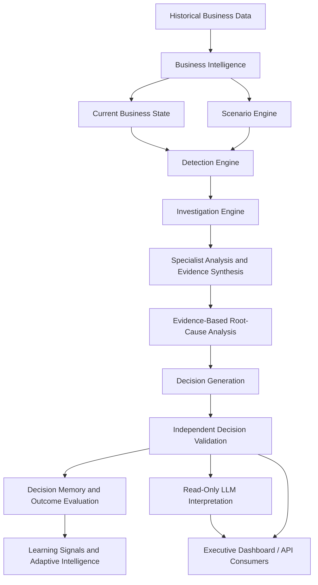

<div align="center">

# ORACLE-X

### Autonomous Enterprise Decision Engine

**Evidence-driven business investigations and validated operational decisions — with deterministic logic at the core.**

<p>
  <a href="https://oracle-x.streamlit.app/"><strong>Open Live Dashboard</strong></a>
  &nbsp;·&nbsp;
  <a href="https://oracle-x.fastapicloud.dev/docs"><strong>Explore API Docs</strong></a>
  &nbsp;·&nbsp;
  <a href="https://github.com/AbdelrhmanAkl/ORACLE-X"><strong>View Repository</strong></a>
</p>

[](https://www.python.org/)
[](https://fastapi.tiangolo.com/)
[](https://streamlit.io/)
[](https://www.sqlite.org/)
[](#decision-integrity)

</div>

---

## Overview

ORACLE-X is an AI decision-intelligence prototype that investigates detected business conditions, assembles evidence, evaluates potential root causes, and generates decisions that pass through an independent validation stage. It combines a Streamlit executive dashboard with a FastAPI backend and SQLite-based storage.

The system is designed to make business investigations more traceable by distinguishing historical observations, model-derived metrics, simulated scenario changes, deterministic analysis, and generated language-model interpretations.

> **Core principle:** deterministic business logic remains authoritative. The optional large language model (LLM) explains existing investigation results; it does not create or modify the authoritative decision, rules, or thresholds.

## Try ORACLE-X

| Resource | Description |
| --- | --- |
| [Live Streamlit dashboard](https://oracle-x.streamlit.app/) | Explore the executive-facing application. |
| [Interactive API documentation](https://oracle-x.fastapicloud.dev/docs) | Inspect and try the deployed FastAPI endpoints. |
| [Backend base URL](https://oracle-x.fastapicloud.dev/) | Access the hosted API service. |
| [Deployment dashboard](https://dashboard.fastapicloud.com/abdoakl441-562425d8/apps/oracle-x/deployments) | View the backend deployment dashboard. |
| [GitHub repository](https://github.com/AbdelrhmanAkl/ORACLE-X) | Browse the source code and project structure. |

## Key Capabilities

- **Business intelligence:** organizes business signals such as orders, revenue, customers, products, sellers, reviews, inventory, and operational activity.
- **Scenario simulation:** evaluates controlled scenarios to explore how changes in demand, inventory, supply, and customer experience affect the investigation workflow.
- **Deterministic anomaly detection:** applies explicit business rules to identify conditions that warrant investigation.
- **Evidence-led investigation:** coordinates specialist analysis, evidence synthesis, and decision generation.
- **Root-cause analysis:** ranks candidate factors while communicating uncertainty and evidence limitations instead of asserting unsupported causality.
- **Decision validation:** validates generated decisions before they proceed into decision memory and outcome evaluation.
- **Decision memory and learning signals:** stores validated decisions and evaluates available observed outcomes; the system can explicitly report when evidence is insufficient.
- **Provenance and traceability:** distinguishes historical, model-derived, simulated, deterministic, and LLM-generated information.
- **Optional LLM interpretation:** produces executive-friendly explanations of already-generated evidence through the Groq API.
- **REST API and dashboard:** exposes investigation workflows through FastAPI and presents results through Streamlit.

## Decision Integrity

ORACLE-X separates its workflow into distinct responsibilities:

1. **Business evidence** — historical data and scenario inputs.
2. **Detection and investigation** — deterministic rules identify conditions and organize evidence.
3. **Evidence synthesis and RCA** — candidate explanations are evaluated against available signals.
4. **Decision generation** — business logic produces a proposed operational decision.
5. **Independent validation** — a separate validation stage checks the generated decision.
6. **Memory and outcome evaluation** — validated decisions and observed outcomes can inform learning signals.
7. **LLM interpretation** — an optional read-only layer explains the existing result for executive review.

The LLM is not the authority for business metrics, anomaly detection, root-cause facts, validation, simulation state, or historical calculations. It must not be described as proving causal relationships or changing business rules.

## Example Investigation

A demonstrated investigation for **Incident #2 — Demand and Supply Imbalance Detected** returned the following statuses:

| Field | Demonstrated result |
| --- | --- |
| Severity | `HIGH` |
| Decision status | `ACTIONABLE` |
| Validation status | `VALID` |
| LLM status | `INTERPRETATION_AVAILABLE` |
| Interpretation model | `openai/gpt-oss-120b` |
| Decision control | `READ-ONLY` |

The investigation also reported `llm_used: true`, while `decision_modified`, `rules_modified`, `thresholds_modified`, and `causal_claims_generated` were all `false`.

**Executive recommendation:** Prioritize inventory protection and monitor demand and supplier conditions.

### Example scenario signals

| Signal | Demonstrated value | Provenance |
| --- | ---: | --- |
| Daily orders | 338.30 | Scenario-driven |
| Demand change | +25.0% | Simulated |
| Inventory coverage | 9.18 days | Model-derived |
| Inventory coverage change | -34.4% | Model-derived scenario indicator |
| Daily revenue | $45,385.72 | Scenario-driven |
| Revenue change | +25.0% | Simulated |
| Customer review score | 3.95 | Scenario-driven |
| Customer score change | -0.30 | Simulated |

These values are from a **controlled scenario**, not verified real-time business operations. Inventory coverage is model-derived, and simulated supplier pressure is not proof of an actual supplier issue. RCA results identify candidate factors and confidence limitations; they do not establish causality.

## Architecture



The diagram represents the documented logical workflow. The LLM is an interpretation layer, not a decision authority.

## Provenance Model

| Information type | Provenance label |
| --- | --- |
| Historical business data | `OBSERVED_HISTORICAL` |
| Inventory level and coverage | `MODEL_DERIVED` |
| Scenario changes | `SIMULATED` |
| Root-cause analysis | `DETERMINISTIC_RCA` |
| Learning signals | `DETERMINISTIC_OBSERVED_OUTCOMES` |
| Adaptive intelligence | `DETERMINISTIC_READ_ONLY` |
| LLM interpretation | `LLM_EVIDENCE_INTERPRETATION` |

Provenance labels help reviewers distinguish observations from calculations, scenario assumptions, deterministic conclusions, and generated explanations.

## Historical Dataset

The project uses the **Brazilian E-Commerce Public Dataset by Olist** as its historical business foundation. The supplied project documentation reports the following dataset-level counts:

- 99,441 orders
- 112,650 order items
- 3,095 sellers
- 99,224 reviews
- 23 seller states

For the documented August 2018 business window, the project reports 5,954 total orders, 5,855 delivered orders, 5,997 active customers, $798,785.87 in item revenue, a canonical average order value (AOV) of $134.16, an average review score of 4.25, 4,079 inventory products, and 14.00 days of inventory coverage.

These are project-reported historical or derived figures, not live operational metrics. Raw source data is intentionally excluded from Git tracking.

## Anomaly Detection Example

The documented detection engine includes the `DEMAND_SUPPLY_IMBALANCE` rule. It requires all of the following conditions:

- Demand increase of at least 15%.
- Inventory coverage decline of at least 20%.
- Current inventory coverage of 10 days or less.

The detector also documents rule versioning and prevention of duplicate detections for the same snapshot, rule, and version combination.

## API Reference

The deployed backend exposes these documented endpoints:

| Method | Endpoint | Purpose |
| --- | --- | --- |
| `GET` | `/health` | Health check |
| `POST` | `/investigate/{incident_id}` | Run an incident investigation |
| `POST` | `/investigate/{incident_id}/summary` | Generate an investigation summary |
| `GET` | `/investigate/{incident_id}/summary` | Retrieve an investigation summary |

The live [Swagger UI](https://oracle-x.fastapicloud.dev/docs) is the preferred reference for the current API behavior.

### Example: Run an Investigation

```bash
curl -X POST "https://oracle-x.fastapicloud.dev/investigate/2"
```

This example uses Incident `2`, which is referenced in the documented demonstration. Refer to the live API documentation for the current response schema and interactive testing.

## Technology Stack

- **Language:** Python
- **API:** FastAPI
- **Executive interface:** Streamlit
- **Storage:** SQLite
- **Data processing:** Pandas and NumPy
- **HTTP communication:** Requests / REST JSON
- **LLM integration:** Groq Python SDK
- **Configuration:** Environment-based settings and `python-dotenv`

## Run Locally

The following commands reflect the local development workflow documented for the project. Review the repository files and configuration before running them in a fresh environment.

### 1. Clone the repository

```powershell
git clone https://github.com/AbdelrhmanAkl/ORACLE-X.git
cd ORACLE-X
```

### 2. Create and activate a virtual environment

```powershell
python -m venv .venv
.\.venv\Scripts\Activate.ps1
```

### 3. Install dependencies

```powershell
pip install -r requirements.txt
```

### 4. Configure environment variables

Set the server-side Groq API key for LLM interpretation. Do not commit credentials or paste them into logs.

```dotenv
GROQ_API_KEY=your_groq_api_key_here
```

If using a local `.env` file, keep it out of version control. The repository documentation has referenced `.env.example`; check the current repository for its exact contents and required settings before copying it.

For the Streamlit dashboard, `ORACLE_X_API_URL` can be used to configure the backend URL. For local development, the documented API URL is `http://127.0.0.1:8000`; the hosted backend base URL is `https://oracle-x.fastapicloud.dev`.

### 5. Start the API

```powershell
uvicorn api.main:app --reload
```

The local API should be available at `http://127.0.0.1:8000`, with interactive documentation at `http://127.0.0.1:8000/docs`.

### 6. Start the dashboard

Open a second terminal in the project root, activate the same virtual environment, then run:

```powershell
streamlit run app.py
```

The dashboard uses the configured FastAPI URL. Set `ORACLE_X_API_URL` to the local API address when testing the local backend.

> **Database note:** ORACLE-X uses SQLite, and deployment includes a database bootstrap process. The local database may be excluded from the repository. Confirm the current bootstrap instructions and required data files in the source before running investigations locally; do not assume that cloning the repository includes the populated database.

## Tests and Verification

The existing project documentation lists tests for adaptive intelligence and LLM interpretation. If those test files are present in the current checkout, run:

```powershell
pytest
```

The documented API smoke-test commands are:

```powershell
Invoke-RestMethod http://127.0.0.1:8000/health
```

```powershell
Invoke-RestMethod -Method Post http://127.0.0.1:8000/investigate/2
```

A successful historical end-to-end demonstration is not a guarantee that every environment or deployment will produce the same results. Verify the current source, configuration, and live API before relying on the workflow.

## Reliability, Limitations, and Responsible Use

- **Scenario data is not live data.** Simulated values must not be presented as actual current business conditions.
- **Derived metrics are not direct observations.** Inventory coverage and other calculated indicators depend on their underlying assumptions and data.
- **RCA is evidence-constrained.** Candidate causes and confidence levels do not prove causality.
- **The LLM is read-only.** Its role is to interpret existing evidence, not change the decision, business rules, or thresholds.
- **Learning depends on outcomes.** Adaptive intelligence should report insufficient evidence when the number or quality of observed outcomes is inadequate.
- **A portfolio prototype is not a guarantee of production readiness.** Organizations would need to assess authentication, authorization, monitoring, operational controls, data quality, and deployment requirements for their own use cases.

## Roadmap

Potential future improvements—not claims of currently implemented functionality—include:

- Stronger authentication and authorization.
- Expanded monitoring and observability.
- Broader observed outcome datasets and decision-quality evaluation.
- Automated data refresh pipelines.
- CI/CD and deployment hardening.
- More extensive automated integration tests.

## Project Structure

The supplied project documentation describes the following main components. Confirm the current repository tree if it has changed.

```text
ORACLE-X/
├── api/
│   └── main.py
├── config/
│   └── settings.py
├── data/
│   └── oracle_x.db
├── legacy/
├── src/
│   ├── agents/
│   ├── data/
│   ├── debate/
│   ├── decision/
│   ├── intelligence/
│   ├── investigation/
│   ├── learning/
│   ├── simulation/
│   └── validation/
├── tests/
├── app.py
├── requirements.txt
└── .env.example
```

The database file and raw source data may be local or ignored by Git and therefore may not appear in a clone.

## Author

**Abdelrahman Akl**  
AI Engineer focused on Agentic AI, LLMs, and AI-driven decision systems.

- [GitHub](https://github.com/AbdelrhmanAkl)
- [LinkedIn](https://linkedin.com/in/abdelrahmanakl/)

## License

Check the repository for a license file and its terms before reusing or redistributing this project. No license is asserted here.

---

<div align="center">

**ORACLE-X — Evidence first. Decisions validated. AI-assisted interpretation.**

</div>
