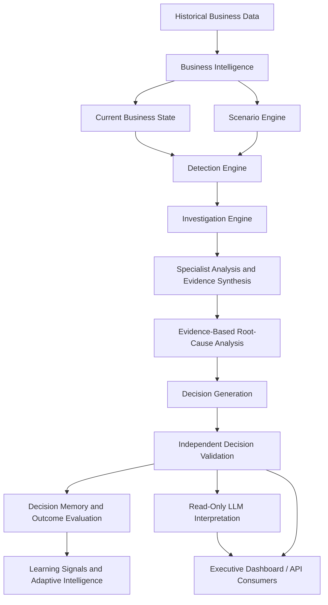
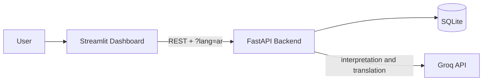

<div align="center">

# ORACLE-X

### Autonomous Enterprise Decision Engine

**Evidence-driven business investigations and validated operational decisions, with deterministic logic at the core.**

<p>
  <a href="https://oracle-x.streamlit.app/"><strong>Live Dashboard</strong></a>
  &nbsp;·&nbsp;
  <a href="https://oracle-x.fastapicloud.dev/docs"><strong>API Docs</strong></a>
  &nbsp;·&nbsp;
  <a href="https://github.com/AbdelrhmanAkl/ORACLE-X"><strong>Repository</strong></a>
</p>

[](https://www.python.org/)
[](https://fastapi.tiangolo.com/)
[](https://streamlit.io/)
[](https://www.sqlite.org/)
[](https://groq.com/)
[](#decision-integrity)

</div>

---

## Table of Contents

- [Overview](#overview)
- [Live Demo](#live-demo)
- [Key Capabilities](#key-capabilities)
- [Decision Integrity](#decision-integrity)
- [How It Works](#how-it-works)
- [Architecture](#architecture)
- [Design Decisions](#design-decisions)
- [Example Investigation](#example-investigation)
- [Provenance Model](#provenance-model)
- [Arabic and English Support](#arabic-and-english-support)
- [Technology Stack](#technology-stack)
- [API Reference](#api-reference)
- [API Response Example](#api-response-example)
- [Deployment](#deployment)
- [Run Locally](#run-locally)
- [Configuration](#configuration)
- [Testing](#testing)
- [Project Structure](#project-structure)
- [Historical Dataset](#historical-dataset)
- [Detection Rule](#detection-rule)
- [Limitations and Responsible Use](#limitations-and-responsible-use)
- [Roadmap](#roadmap)
- [Author](#author)

---

## Overview

ORACLE-X is an AI decision-intelligence system that investigates detected business conditions, assembles evidence, ranks candidate root causes, and produces operational decisions that pass through an independent validation stage before being stored or presented.

It pairs a **Streamlit executive dashboard** with a **FastAPI backend** and **SQLite** storage, and it makes every number traceable by labeling whether it is observed, model-derived, simulated, deterministic, or generated by a language model.

> **Core principle:** deterministic business logic is authoritative. The optional large language model (LLM) only explains results that already exist. It never creates or modifies the decision, the rules, or the thresholds.

## Live Demo

| Resource | Link |
| --- | --- |
| Executive dashboard (Streamlit) | [oracle-x.streamlit.app](https://oracle-x.streamlit.app/) |
| Interactive API docs (Swagger) | [oracle-x.fastapicloud.dev/docs](https://oracle-x.fastapicloud.dev/docs) |
| Backend base URL | [oracle-x.fastapicloud.dev](https://oracle-x.fastapicloud.dev/) |
| Deployment dashboard | [FastAPI Cloud deployments](https://dashboard.fastapicloud.com/abdoakl441-562425d8/apps/oracle-x/deployments) |
| Source code | [github.com/AbdelrhmanAkl/ORACLE-X](https://github.com/AbdelrhmanAkl/ORACLE-X) |

Quick check that the backend is up:

```bash
curl https://oracle-x.fastapicloud.dev/health
```

> The first request after a period of inactivity may be slow while the hosted backend wakes up.

## Key Capabilities

- **Business intelligence:** organizes signals across orders, revenue, customers, products, sellers, reviews, inventory, and operations.
- **Scenario simulation:** applies controlled changes to demand, inventory, supply, and customer experience to exercise the investigation workflow.
- **Deterministic anomaly detection:** explicit, versioned business rules decide when a condition warrants investigation.
- **Evidence-led investigation:** specialist analysis and evidence synthesis feed a single investigation record.
- **Root-cause analysis:** ranks candidate factors and states confidence limits instead of asserting unsupported causality.
- **Independent decision validation:** a separate stage checks each generated decision before it reaches decision memory.
- **Decision memory and learning signals:** stores validated decisions and evaluates observed outcomes, and reports explicitly when evidence is insufficient.
- **Provenance on every figure:** historical, model-derived, simulated, deterministic, and LLM-generated information are labeled separately.
- **Read-only LLM interpretation:** executive-friendly explanations generated through the Groq API.
- **Bilingual output:** investigation summaries are available in English and Arabic.
- **REST API and dashboard:** every workflow is available over HTTP and through the Streamlit UI.

## Decision Integrity

The workflow separates responsibilities so that no single component can silently change an outcome:

| # | Stage | Responsibility |
| --- | --- | --- |
| 1 | Business evidence | Historical data and scenario inputs |
| 2 | Detection and investigation | Deterministic rules identify conditions and organize evidence |
| 3 | Evidence synthesis and RCA | Candidate explanations are weighed against available signals |
| 4 | Decision generation | Business logic proposes an operational decision |
| 5 | Independent validation | A separate stage checks the proposed decision |
| 6 | Memory and outcome evaluation | Validated decisions and observed outcomes inform learning signals |
| 7 | LLM interpretation | Optional, read-only explanation for executive review |

The LLM is **not** an authority for business metrics, anomaly detection, root-cause facts, validation, simulation state, or historical calculations. Each investigation reports flags confirming this: `decision_modified`, `rules_modified`, `thresholds_modified`, and `causal_claims_generated` are all `false`.

## How It Works

This walkthrough follows **Incident #2** from detection to the executive summary, using the scenario values shown in [Example Investigation](#example-investigation).

**1. Build the business state.** Historical Olist data is aggregated into business signals: orders, revenue, review score, and inventory coverage.

**2. Apply a scenario.** The scenario engine applies a controlled change. For Incident #2, demand rises by 25.0%, which pushes inventory coverage down by 34.4% to 9.18 days.

**3. Evaluate the detection rule.** The `DEMAND_SUPPLY_IMBALANCE` rule checks three conditions, and all must hold:

| Condition | Threshold | Incident #2 | Met |
| --- | --- | --- | --- |
| Demand increase | at least 15% | +25.0% | Yes |
| Inventory coverage decline | at least 20% | -34.4% | Yes |
| Current inventory coverage | 10 days or less | 9.18 days | Yes |

**4. Investigate.** The investigation engine gathers evidence across the available signals and records it in one investigation.

**5. Rank candidate causes.** Root-cause analysis ranks candidate factors and attaches confidence limits. It does not claim proven causality.

**6. Generate a decision.** Business logic proposes an operational decision (here, prioritize inventory protection and monitor demand and supplier conditions).

**7. Validate independently.** A separate validation stage checks the decision. Only a decision that passes (`VALID`) is stored in decision memory.

**8. Interpret for executives.** The optional LLM layer reads the finished result and writes a plain-language explanation. It cannot change the decision, rules, or thresholds.

**9. Deliver.** The result is served by the FastAPI backend and shown in the Streamlit dashboard, in English or Arabic.

## Architecture



**Deployment topology**



The Streamlit app holds no LLM credentials. The backend owns the Groq key and performs both interpretation and translation.

## Design Decisions

| Decision | Why |
| --- | --- |
| **The LLM is read-only** | Business decisions must be reproducible and auditable. A language model can vary between runs, so it explains results but never produces or changes them. |
| **Deterministic, versioned detection rules** | Explicit thresholds make it clear why an incident fired, and versioning plus duplicate prevention keeps results stable across reruns. |
| **Independent validation stage** | The component that proposes a decision should not be the one that approves it. Separating the two catches faulty decisions before they reach memory. |
| **Provenance labels on every figure** | Observed data, model-derived values, and simulated changes can look identical in a dashboard. Labels stop a scenario number from being mistaken for a real one. |
| **RCA reports candidates, not causes** | Correlated signals do not prove causality. The system states confidence limits instead of overclaiming. |
| **Insufficient-evidence reporting** | When there are too few observed outcomes, the learning layer says so rather than producing misleading adaptation signals. |
| **Backend-owned API key** | The Groq key lives only on the backend. The Streamlit app carries no credentials and cannot leak one. |
| **Translation guarded by number checks** | A translated sentence that changes any figure is discarded and the English original is kept, so translation can never alter a metric. |
| **Graceful LLM failure** | If the LLM or translation is unavailable, the deterministic investigation still completes and the response reports the failure status. |
| **SQLite storage** | A single-file database keeps the prototype simple to deploy and reproduce. A production deployment would likely move to a managed database. |

## Example Investigation

A demonstrated investigation for **Incident #2, Demand and Supply Imbalance Detected**:

| Field | Result |
| --- | --- |
| Severity | `HIGH` |
| Decision status | `ACTIONABLE` |
| Validation status | `VALID` |
| LLM status | `INTERPRETATION_AVAILABLE` |
| Interpretation model | `openai/gpt-oss-120b` |
| Decision control | `READ-ONLY` |

**Executive recommendation:** prioritize inventory protection and monitor demand and supplier conditions.

| Signal | Value | Provenance |
| --- | ---: | --- |
| Daily orders | 338.30 | Scenario-driven |
| Demand change | +25.0% | Simulated |
| Inventory coverage | 9.18 days | Model-derived |
| Inventory coverage change | -34.4% | Model-derived scenario indicator |
| Daily revenue | $45,385.72 | Scenario-driven |
| Revenue change | +25.0% | Simulated |
| Customer review score | 3.95 | Scenario-driven |
| Customer score change | -0.30 | Simulated |

These values come from a **controlled scenario**, not live operations. Simulated supplier pressure is not evidence of a real supplier issue, and RCA output lists candidate factors with confidence limits rather than proven causes.

## Provenance Model

| Information type | Label |
| --- | --- |
| Historical business data | `OBSERVED_HISTORICAL` |
| Inventory level and coverage | `MODEL_DERIVED` |
| Scenario changes | `SIMULATED` |
| Root-cause analysis | `DETERMINISTIC_RCA` |
| Learning signals | `DETERMINISTIC_OBSERVED_OUTCOMES` |
| Adaptive intelligence | `DETERMINISTIC_READ_ONLY` |
| LLM interpretation | `LLM_EVIDENCE_INTERPRETATION` |

## Arabic and English Support

Summary endpoints accept an optional `lang` query parameter.

```bash
# English (default)
curl "https://oracle-x.fastapicloud.dev/investigate/2/summary"

# Arabic
curl "https://oracle-x.fastapicloud.dev/investigate/2/summary?lang=ar"
```

How translation is kept safe:

- Only **text fields** are translated. The decision, numbers, provenance labels, and severity are never altered.
- If a translated sentence changes any number, that sentence **stays in English**.
- Translations are cached in memory, so repeated requests do not trigger repeated LLM calls.
- If translation fails (for example, a missing API key), the request does not fail. The API returns English with `translation.status = "FAILED"` and the reason.
- An unsupported language returns `400`.

The translation logic lives in `src/intelligence/summary_translator.py` and runs entirely on the backend.

## Technology Stack

| Layer | Technology |
| --- | --- |
| Language | Python |
| API | FastAPI |
| Executive interface | Streamlit |
| Storage | SQLite |
| Data processing | Pandas, NumPy |
| HTTP communication | Requests, REST JSON |
| LLM integration | Groq Python SDK |
| Configuration | Environment variables, `python-dotenv` |
| Testing | pytest |
| Hosting | FastAPI Cloud (backend), Streamlit Community Cloud (dashboard) |

## API Reference

| Method | Endpoint | Purpose |
| --- | --- | --- |
| `GET` | `/health` | Health check |
| `POST` | `/investigate/{incident_id}` | Run an incident investigation |
| `POST` | `/investigate/{incident_id}/summary` | Generate an investigation summary |
| `GET` | `/investigate/{incident_id}/summary` | Retrieve an investigation summary |

`/summary` endpoints accept `?lang=en` (default) or `?lang=ar`.

The live [Swagger UI](https://oracle-x.fastapicloud.dev/docs) is the source of truth for request and response schemas.

```bash
curl -X POST "https://oracle-x.fastapicloud.dev/investigate/2"
```

## API Response Example

The summary endpoint returns the investigation result as JSON. The example below is **abridged and illustrative**: it shows the shape of the fields documented in this README, with values from the Incident #2 scenario. Field names and nesting may differ slightly, so use the live [Swagger UI](https://oracle-x.fastapicloud.dev/docs) or a real call as the source of truth.

```bash
curl "https://oracle-x.fastapicloud.dev/investigate/2/summary?lang=en"
```

```json
{
  "incident": {
    "title": "Demand and Supply Imbalance Detected",
    "severity": "HIGH"
  },
  "decision": {
    "status": "ACTIONABLE",
    "recommendation": "Prioritize inventory protection and monitor demand and supplier conditions."
  },
  "validation": {
    "status": "VALID"
  },
  "scenario_metrics": {
    "demand": { "change_pct": 25.0 }
  },
  "llm": {
    "status": "INTERPRETATION_AVAILABLE",
    "model": "openai/gpt-oss-120b",
    "llm_used": true,
    "decision_modified": false,
    "rules_modified": false,
    "thresholds_modified": false,
    "causal_claims_generated": false
  }
}
```

With `?lang=ar`, the text fields come back in Arabic and the response also carries translation status:

```json
{
  "translation": { "status": "OK" }
}
```

If translation fails, the English response is returned unchanged with `"status": "FAILED"` and the reason.

## Deployment

| Component | Host | Notes |
| --- | --- | --- |
| Backend | FastAPI Cloud | Holds `GROQ_API_KEY`; redeploys on repository updates |
| Dashboard | Streamlit Community Cloud | Reads `ORACLE_X_API_URL`; needs no LLM key |

To verify a deployment after an update:

1. Open `/health` on the backend and confirm it responds.
2. Open `/investigate/2/summary?lang=ar` and confirm `translation.status` is `OK`.
3. Open the dashboard, switch language, and run an incident.

## Run Locally

**1. Clone**

```powershell
git clone https://github.com/AbdelrhmanAkl/ORACLE-X.git
cd ORACLE-X
```

**2. Create a virtual environment**

```powershell
python -m venv .venv
.\.venv\Scripts\Activate.ps1
```

On macOS or Linux: `python -m venv .venv && source .venv/bin/activate`

**3. Install dependencies**

```powershell
pip install -r requirements.txt
```

**4. Configure environment** (see [Configuration](#configuration))

**5. Start the API**

```powershell
uvicorn api.main:app --reload
```

API: `http://127.0.0.1:8000` · Docs: `http://127.0.0.1:8000/docs`

**6. Start the dashboard** (second terminal, same environment)

```powershell
$env:ORACLE_X_API_URL = "http://127.0.0.1:8000"
streamlit run app.py
```

> **Database note:** ORACLE-X uses SQLite and a bootstrap process on deployment. The populated database and raw source data may be excluded from Git, so a fresh clone may not contain them. Check the bootstrap code before running investigations locally.

## Configuration

| Variable | Used by | Purpose |
| --- | --- | --- |
| `GROQ_API_KEY` | Backend | LLM interpretation and Arabic translation |
| `ORACLE_X_API_URL` | Dashboard | Backend base URL (defaults to the hosted backend) |

Create a `.env` file (never commit it):

```dotenv
GROQ_API_KEY=your_groq_api_key_here
```

Without `GROQ_API_KEY`, investigations still run deterministically. Only LLM interpretation and translation are unavailable.

## Testing

```powershell
pytest
```

The translator tests run **offline** with a mocked model and do not call Groq:

```powershell
pytest tests/test_summary_translator.py
```

Smoke-test a running API:

```powershell
Invoke-RestMethod http://127.0.0.1:8000/health
Invoke-RestMethod -Method Post http://127.0.0.1:8000/investigate/2
```

## Project Structure

```text
ORACLE-X/
├── api/
│   └── main.py                      # FastAPI app and endpoints
├── config/
│   └── settings.py
├── data/
│   └── oracle_x.db                  # SQLite (may be git-ignored)
├── legacy/
├── src/
│   ├── agents/
│   ├── data/
│   ├── debate/
│   ├── decision/
│   ├── intelligence/
│   │   └── summary_translator.py    # Arabic translation layer
│   ├── investigation/
│   ├── learning/
│   ├── simulation/
│   └── validation/
├── tests/
│   └── test_summary_translator.py
├── app.py                           # Streamlit dashboard
├── requirements.txt
└── .env.example
```

## Historical Dataset

ORACLE-X is built on the **Brazilian E-Commerce Public Dataset by Olist**:

- 99,441 orders
- 112,650 order items
- 3,095 sellers
- 99,224 reviews
- 23 seller states

For the documented August 2018 window: 5,954 total orders, 5,855 delivered orders, 5,997 active customers, $798,785.87 item revenue, $134.16 average order value, 4.25 average review score, 4,079 inventory products, and 14.00 days of inventory coverage.

These are project-reported historical or derived figures, not live metrics. Raw source data is excluded from Git tracking.

## Detection Rule

The detection engine currently implements one rule, `DEMAND_SUPPLY_IMBALANCE`, which fires when **all** of the following hold:

- Demand increases by at least 15%.
- Inventory coverage declines by at least 20%.
- Current inventory coverage is 10 days or less.

The detector is versioned and prevents duplicate detections for the same snapshot, rule, and version. Scenario incidents differ by the **severity of the demand shock** (for example +15%, +25%, +50%), not by detection rule.

## Limitations and Responsible Use

- **Scenario data is not live data.** Simulated values must not be presented as current business conditions.
- **Derived metrics are not observations.** Inventory coverage depends on its underlying assumptions.
- **RCA is evidence-constrained.** Candidate causes and confidence levels do not prove causality.
- **The LLM is read-only.** It explains; it does not decide.
- **Learning depends on outcomes.** The system reports insufficient evidence when observed outcomes are too few.
- **This is a portfolio prototype, not a production guarantee.** Real use would require authentication, authorization, monitoring, data-quality controls, and operational hardening.

## Roadmap

Planned improvements, not currently implemented:

- Authentication and authorization.
- Additional detection rules (revenue decline, delivery performance, and others).
- Monitoring and observability.
- Larger observed-outcome datasets and decision-quality evaluation.
- Automated data refresh pipelines.
- CI/CD and deployment hardening.
- Broader integration test coverage.

## Author

**Abdelrahman Akl**

AI Engineer focused on Agentic AI, LLMs, and AI-driven decision systems.

[GitHub](https://github.com/AbdelrhmanAkl) · [LinkedIn](https://linkedin.com/in/abdelrahmanakl/)

## License

No license is asserted here. Add a `LICENSE` file to the repository to define reuse terms.

---

<div align="center">

**ORACLE-X: Evidence first. Decisions validated. AI-assisted interpretation.**

</div>
